<!-- Load jQuery -->

<!-- Load Nivo Slider files -->

<link rel="stylesheet" href="nivo-slider/demo34/demo34-nivo-slider.css" type="text/css">

<!-- Common to all pages -->

<!-- Nivo slider Demo 34 -->

    
	

		
 
			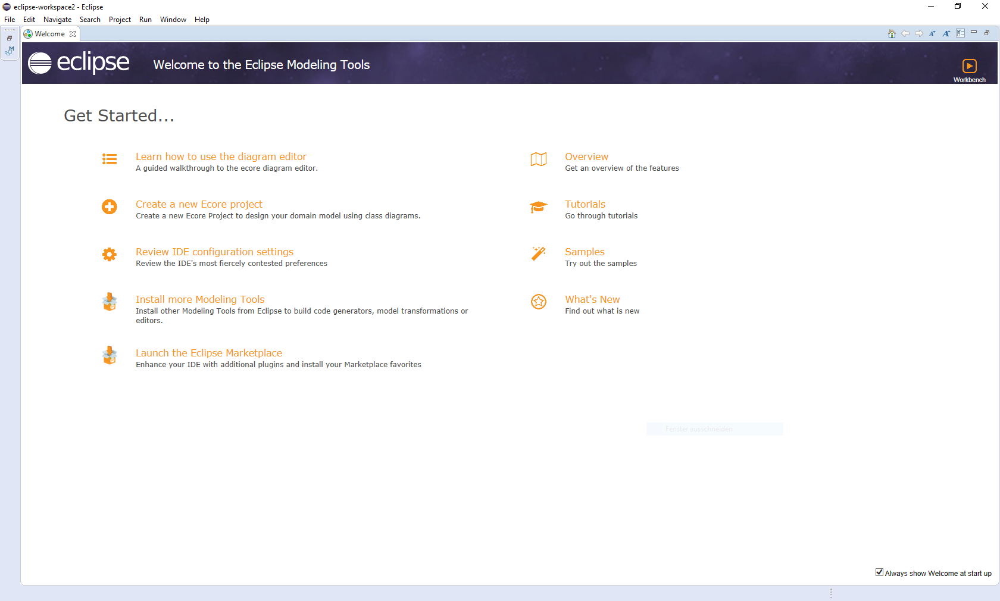Installation:</strong> Download the Eclipse Modeling Tools" alt=""/>
			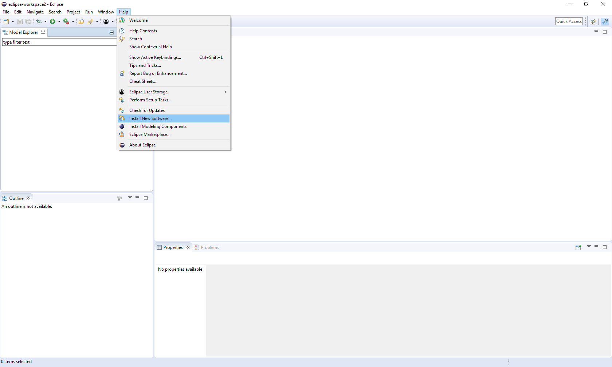
			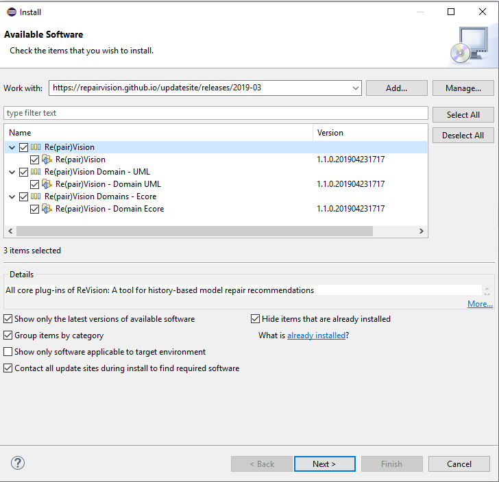
			
			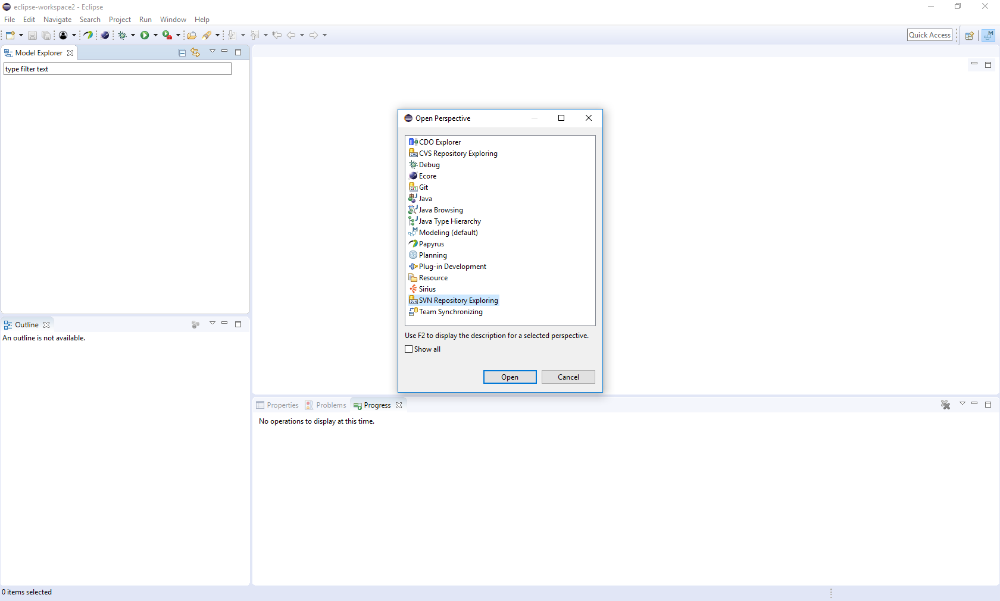
			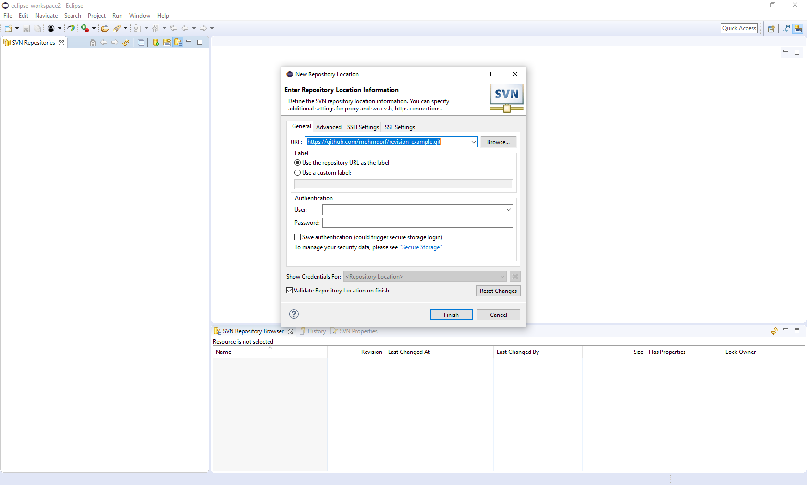
			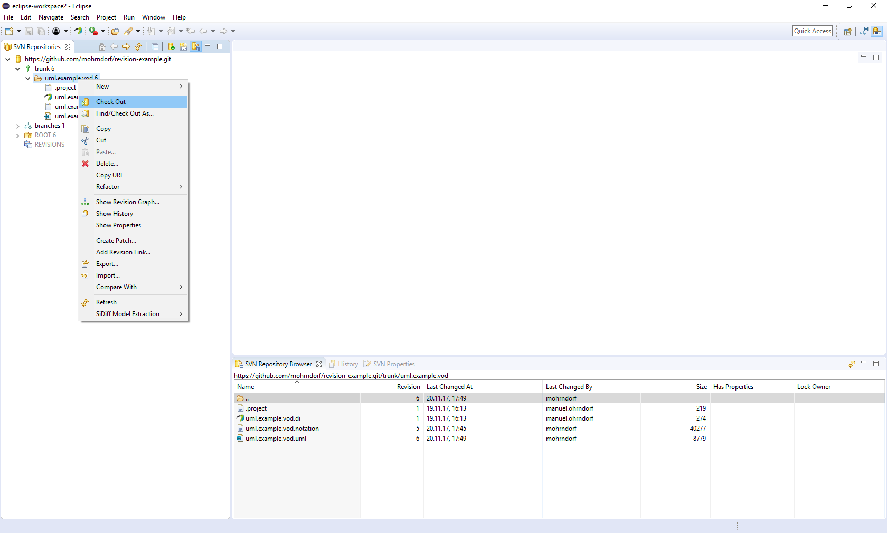
			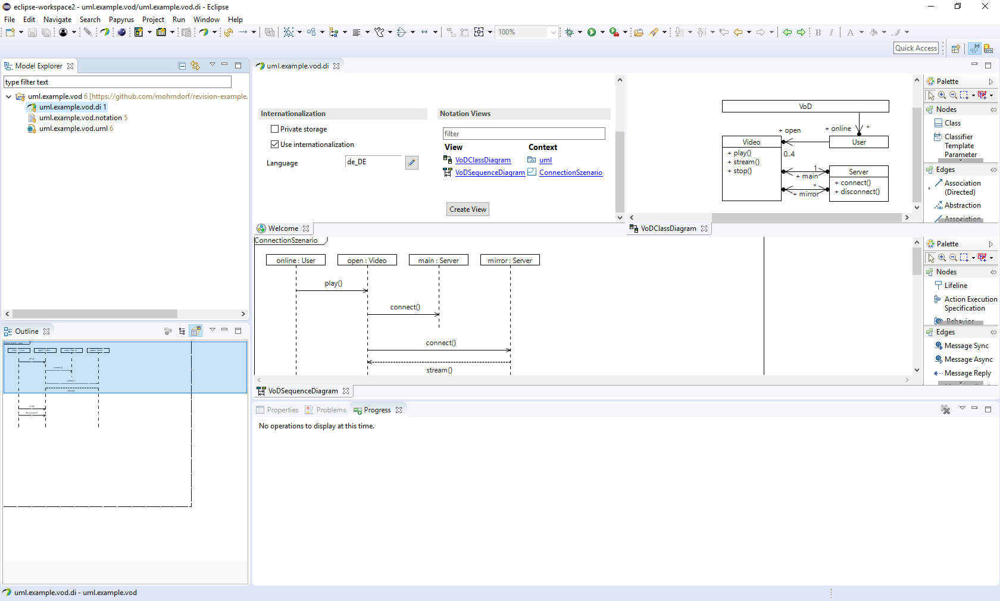
			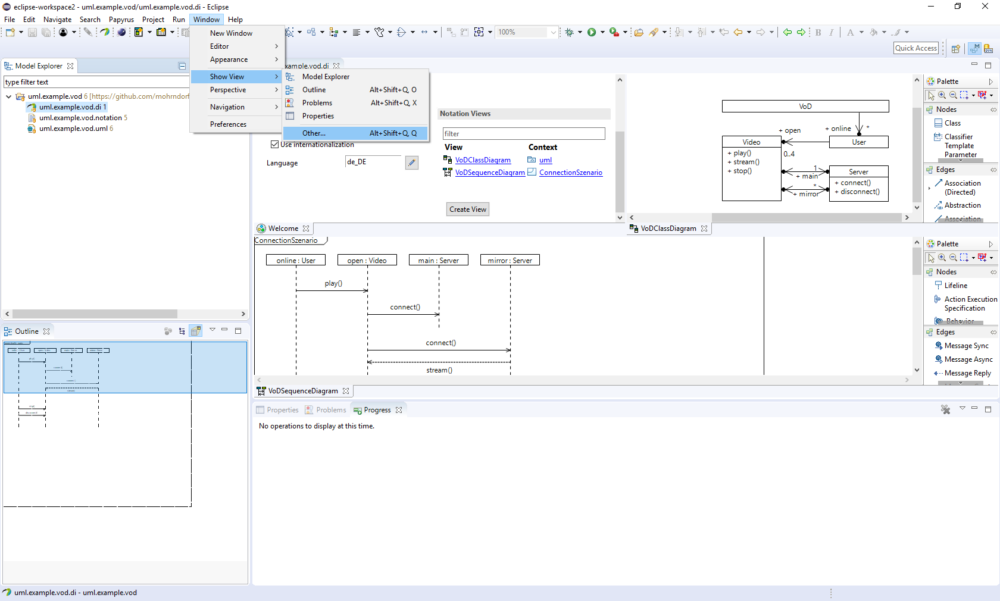 Show View -> Other..." alt=""/>	
			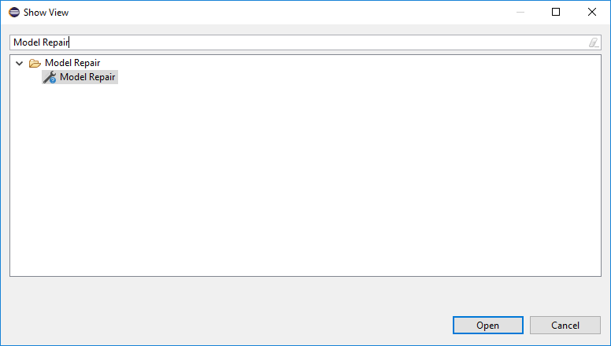
			
			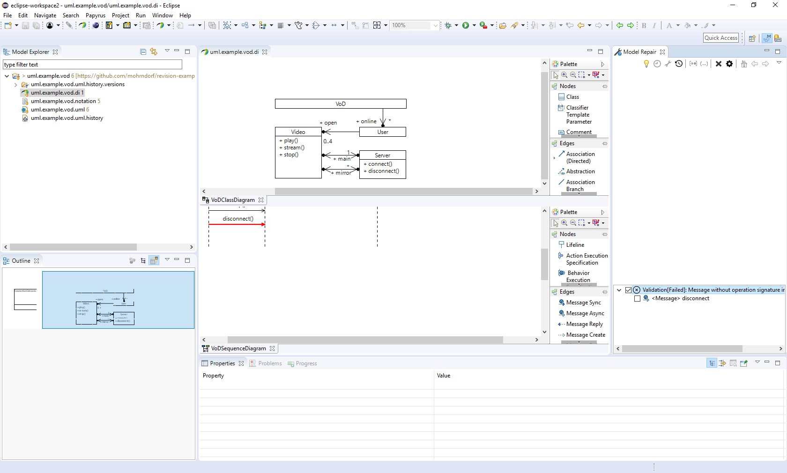
			
			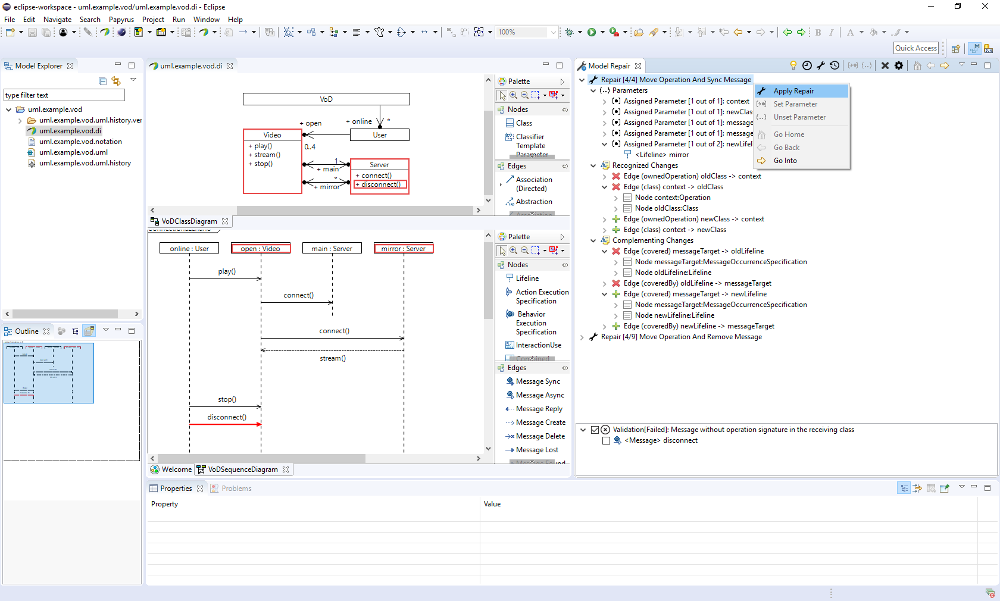
		

	

