In this section we give some minimal examples of model inconsistencies and their repairs collected from literature.

# Create Interface Operation

This example is a simplified version of the running example in <a href="#TOLR2017">[TOLR2017]</a>. <a href="#fig:create_interface_operation.model_a">Figure 1</a> depicts an UML class diagram consisting of an interface IA and a class A implementing this interface. A consistency rule demands that a class must implement all methods of the respective interface.

<figure class="alignleft">
	
	<figcaption>Fig. 1: Create Interface Operation - Model A</figcaption>
</figure>

<figure class="alignleft">
	
	<figcaption>Fig. 1: Create Interface Operation - Model A</figcaption>
</figure>

<a href="{{page.path}}/images/create_interface_operation/model_a.svg" target="_blank">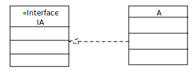</a>

Fig. 1: Create Interface Operation - Model A

In a next stept the interface IA is extended by a the operation signature op() as shown in <a href="#fig:create_interface_operation.model_b">Figure 2</a> introducing an inconsistency regarding the consisteny rule mentioned above. The implementation of the operation is missing in class A.

	
	
Fig. 2: Create Interface Operation - Model B

The introcued inconsistency could be fixed in several ways, e.g.:

<ul>
	<li>remove the operation signature op() from the interface IA, i.e. perform a simple undo.</li>
	<li>remove the association between the interface IA and the class A.</li>
	<li>Add a new operation op() in class A, i.e. implement the operation op() of the interface IA as shown in <a href="#fig:create_interface_operation.model_c">Figure 3</a>.</li>

	<a href="images/create_interface_operation/model_c.svg" target="_blank">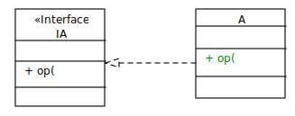</a>
	
Fig. 3: Create Interface Operation - Model C

#Create Message Signature

This is a standard example motivating the problem of editing multiple model views of a model which depend on each other. It serves as running example, among others, in <a href="#MnJC17">[MnJC17]</a> and <a href="#TOLR2017">[TOLR2017]</a>.

<a href="#fig:create_message_signature.model_a">Figure 4</a> shows an UML model from different point of views. The class diagram represents the static structure of the system and consists of the two classes A and B and an association connecting the classes via the properties a and b. The sequence diagram represents the dynamic view, i.e. the behavoir of one scenario using liflines and messages. A lifline represents a property of a class, e.g., a:A represents the property a of the class A.

A consistency rule demands that the signature of a message in a sequence diagram must be identical to the signature of an operation of the class referenced by the receiving lifeline.

	<a href="images/create_message_signature/model_a.svg" target="_blank">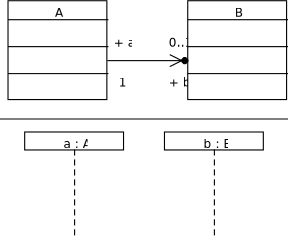</a>
	
Fig. 4: Create Message Signature - Model A

In <a href="#fig:create_message_signature.model_b">Figure 5</a> a new message with the signature op is added to the sequence diagram leading to an inconsistency. The class B referenced by the receiving lifeline of the message op does not contain an operation having the same signature like the message.

	
	
Fig. 5: Create Message Signature - Model B

The introcued inconsistency could be fixed in several ways, e.g.:

<ul>
	<li> remove the message with the signature op, i.e. perform a simple undo</li>
	<li> add a new operation having the same signature like the new message as shown in <a href="#fig:create_message_signature.model_c">Figure 6</a>.</li>
</ul>

	
	
Fig. 6: Create Message Signature - Model C

<h2>Create Transition and Event</h2>

An similar example of the previous one has been depicted in <a href="POKK17">[POKK17]</a> between state machines and class diagramms. <a href="#fig:create_transition_and_event.model_a">Figure 7</a> shows an UML model consisting of the class A and the state machine StateMachineA. The state machine consistes of the two states A and B. A consistency rule may demand that a transition is always triggered by an event, which usually refer to an operation of a class.

	<a href="images/create_transition_and_event/model_a.svg" target="_blank">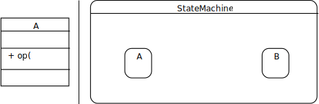</a>
	
Fig. 7: Create Transition and Event - Model A

In <a href="#fig:create_transition_and_event.model_b">Figure 8</a> a transition is added to the state machine leading to an inconsistency. The event of the new transition does not refer to an operation.

	
	
Fig. 8: Create Transition and Event - Model B

The introcued inconsistency could be fixed in several ways, e.g.:

<ul>
	<li> remove the transition, i.e. perform a simple undo</li>
	<li> set the operation op of class A as event of the transition that as illustratrated in <a href="#fig:create_transition_and_event.model_c">Figure 8</a> using equal names</li>
</ul>

	<a href="images/create_transition_and_event/model_c.svg" target="_blank">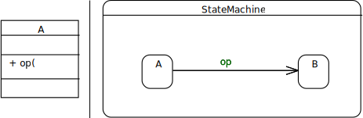</a>
	
Fig. 9: Create Transition and Event - Model C

<h2>Invert Inheritance</h2>

This example has been extracted from <a href="#MnGC13">[MnGC13]</a>. <a href="#fig:invert_inheritance.model_a">Figure 10</a> depicts an UML class diagram consisting of the classes A and B. The class A inherits form the class B via the genralization relation. A consistency rule demands that such a generalization relation must be acyclic.

	<a href="images/invert_inheritance/model_a.svg" target="_blank">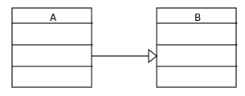</a>
	
Fig. 10: Invert Inheritance - Model A

In <a href="#fig:invert_inheritance.model_b">Figure 11</a> the consistency rule is violated by the creation of the new generalization relation from the class B to the class A.

	<a href="images/invert_inheritance/model_b.svg" target="_blank">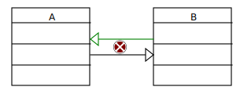</a>
	
Fig. 11: Invert Inheritance - Model B

The introcued inconsistency could be fixed in several ways, e.g.:

<ul>
	<li> remove the new generalization, i.e. perform a simple undo</li>
	<li> remove the old generalization from class A to class B as shown in <a href="#fig:invert_inheritance.model_c">Figure 12</a>.</li>
</ul>

	<a href="images/invert_inheritance/model_c.svg" target="_blank">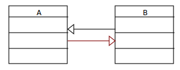</a>
	
Fig. 12: Invert Inheritance - Model C

<h2>Reconnect Transition</h2>

Another example briefly mentioned in <a href="#TOLR2017">[TOLR2017]</a> is the deletion of the target state of a transition. <a href="#fig:reconnect_transition.model_a">Figure 13</a> depicts an UML state machine consisting of the states A, B and C. The states A and B are connected via the transtion triggered by the event op.

	<a href="images/reconnect_transition/model_a.svg" target="_blank">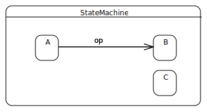</a>
	
Fig. 13: Reconnect Transition - Model A

In <a href="#fig:reconnect_transition.model_b">Figure 14</a>  the target state B of the transition is removed which leads to an inconsistency, since every transition must have extaxtly one source and target state.

	<a href="images/reconnect_transition/model_b.svg" target="_blank">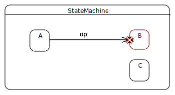</a>
	
Fig. 14: Reconnect Transition - Model B

The introcued inconsistency could be fixed in several ways, e.g.:

<ul>
	<li> re-create the state B and set it as target state of the transition, i.e. perform a simple undo</li>
	<li> remove the transition</li>
	<li> set the state C as target state of the transition as shown in <a href="#fig:reconnect_transition.model_c">Figure 15</a>.</li>
</ul>

	<a href="images/reconnect_transition/model_c.svg" target="_blank">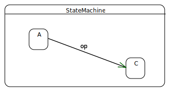</a>
	
Fig. 15: Reconnect Transition - Model C

<h2>Replace Operation Return Parameter</h2>

This example has been extracted from <a href="#PjSM15">[PjSM15]</a>. <a href="#fig:replace_operation_return_parameter.model_a">Figure 16</a> depicts an UML class diagram consisting of the class A. The class contains an operation op() with a return parameter of the type Integer.
A consistency rule demands that an operation must not have more than one return parameter.

	<a href="images/replace_operation_return_parameter/model_a.svg" target="_blank">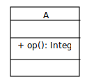</a>
	
Fig. 16: Replace Operation Return Parameter - Model A

In <a href="#fig:replace_operation_return_parameter.model_b">Figure 17</a> a further return parameter of the type String is added to the operation op which violates the consistency rule. 

	<a href="images/replace_operation_return_parameter/model_b.svg" target="_blank">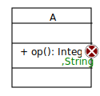</a>
	
Fig. 17: Replace Operation Return Parameter - Model B

The introcued inconsistency could be fixed in several ways, e.g.:

<ul>
	<li> remove the new return parameter, i.e. perform a simple undo</li>
	<li> remove the old return parameter as shown in <a href="#fig:replace_operation_return_parameter.model_c">Figure 18</a>.</li>
</ul>

	
	
Fig. 18: Replace Operation Return Parameter - Model C

<h2>References</h2>
<ul>
<li id="MnGC13">N. Macedo, T. Guimarães and A. Cunha, "Model repair and transformation with Echo," <em>2013 28th IEEE/ACM International Conference on Automated Software Engineering (ASE)</em>, Silicon Valley, CA, 2013, pp. 694-697. doi: 10.1109/ASE.2013.6693135  keywords: {software maintenance;EMF framework;Echo;Eclipse plugin;OCL;OMG standard languages;QVT-R;bidirectional model transformations;development method;inconsistency detection automation;meta-models;model repair;model-driven engineering;software project;solver based engine;Computational modeling;Maintenance engineering;Metals;Object oriented modeling;Semantics;Standards;Unified modeling language}, URL:&nbsp;<a href="http://ieeexplore.ieee.org/stamp/stamp.jsp?tp=&amp;arnumber=6693135&amp;isnumber=6693054">http://ieeexplore.ieee.org/stamp/stamp.jsp?tp=&amp;arnumber=6693135&amp;isnumber=6693054</a></li>
<li id="MnJC17">N. Macedo, T. Jorge and A. Cunha, "A Feature-Based Classification of Model Repair Approaches," in <em>IEEE Transactions on Software Engineering</em>, vol. 43, no. 7, pp. 615-640, July 1 2017. doi: 10.1109/TSE.2016.2620145  keywords: {pattern classification;software maintenance;MDE;consistency management;feature-based classification system;model repair approach;model-driven engineering;Context;Feature extraction;Maintenance engineering;Software engineering;Systematics;Taxonomy;Unified modeling language;Model-driven engineering, consistency management, inconsistency handling, model repair}, URL:&nbsp;<a href="http://ieeexplore.ieee.org/stamp/stamp.jsp?tp=&amp;arnumber=7605502&amp;isnumber=7981478">http://ieeexplore.ieee.org/stamp/stamp.jsp?tp=&amp;arnumber=7605502&amp;isnumber=7981478</a></li>
<li id="POKK17">C. Pietsch, M. Ohrndorf, U. Kelter and T. Kehrer, "Incrementally slicing editable submodels," <em>2017 32nd IEEE/ACM International Conference on Automated Software Engineering (ASE)</em>, Urbana, IL, 2017, pp. 913-918. doi: 10.1109/ASE.2017.8115704  keywords: {Unified Modeling Language;formal specification;object-oriented programming;program slicing;program visualisation;UML model;analysis tools;autonomous model;editable slices;generic incremental slicer;incrementally sliced editable submodels;model differencing framework;model editors;model elements;model management tools;Adaptation models;Computational modeling;Data models;Load modeling;Servers;Tools;Unified modeling language}, URL:&nbsp;<a href="http://ieeexplore.ieee.org/stamp/stamp.jsp?tp=&amp;arnumber=8115704&amp;isnumber=8115603">http://ieeexplore.ieee.org/stamp/stamp.jsp?tp=&amp;arnumber=8115704&amp;isnumber=8115603</a></li>
<li id="PjSM15">Jorge Pinna Puissant, Ragnhild Van Der Straeten, and Tom Mens. 2015. Resolving model inconsistencies using automated regression planning. Software & Systems Modeling 14, 1 (2015), 461–481.</li>
<li id="TOLR2017">Gabriele Taentzer, Manuel Ohrndorf, Yngve Lamo, Adrian Rutle:Change-Preserving Model Repair. FASE 2017: 283-299</li>
</ul>
